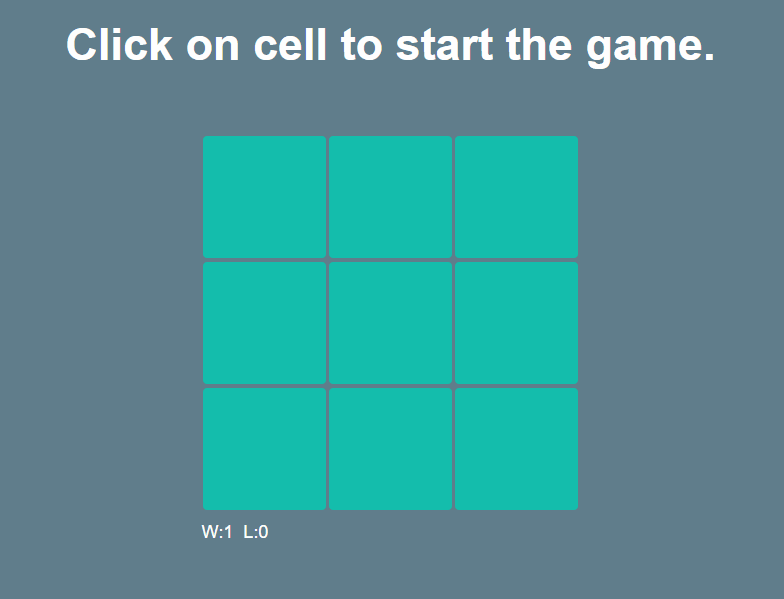

# Tic-Tac-Toe
A simple tic-tac-toe game with AI. It has scoreboard tracking. Randomizes whether player or AI starts the game. Visually stunning. It is completely responsive also.

> A Vue.js project
## Screenshot


## Components break down ##

1. `Game`, the main view with routers
2. `Board`, interactive area of cells
3. `BoardCell`, adds cell logic and styling, makes it clickable
4. `RetryModal`, interactive, says whether player has drawn, won or lost. Lets to restart the game 
5. `StringCollection`, storing all the strings
6. `GameOver`, router view for the Retry modal

## File Structure ##

```
├── assets
│   ├── reset.scss
│   └── styles.scss
├── components
│   ├── Board.vue
│   ├── BoardCell.vue
│   ├── RetryModal.vue
│   └── StringCollection.vue
│   
├── store
│   ├── component
│   │   ├── index.js
│   │   └── board.ts
│   │   
│   └── index.ts
│
├── views
│   ├── Game.vue
│   └── GameOver.vue
├── App.vue
├── main.ts
├── router.ts
```

## Build Setup

``` bash
# install dependencies
npm install

# serve with hot reload at localhost:8080
npm run serve

# build for production with minification
npm run build
```

For detailed explanation on how things work, consult the [docs for vue-loader](http://vuejs.github.io/vue-loader).

## Live demo

[https://dsgnbyhl.com/ttt/](https://dsgnbyhl.com/ttt/)
